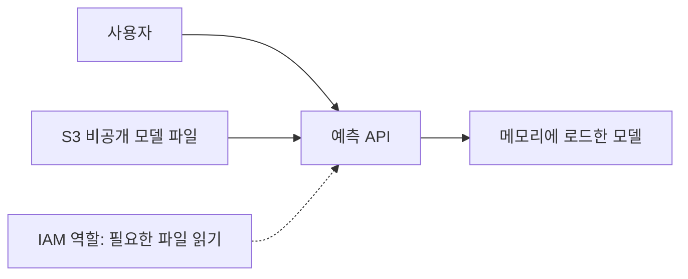

# Day 1 — 오늘 바로 공부하기

날짜: 2026-09-16 / 소요: 60~90분 / 준비물: 이 문서와 메모장. AWS 계정 불필요.

## 오늘 끝나면 할 수 있어야 하는 일

1. 클라우드를 사용하면 무엇을 직접 관리하지 않아도 되는지 설명한다.
2. Region과 Availability Zone(AZ)을 구분한다.
3. EC2·S3·RDS·IAM이 각각 하는 일을 설명한다.
4. 분류 모델 서비스의 간단한 구조를 그린다.

## 0~15분: 클라우드는 무엇인가

분류 모델을 학습한 뒤 친구에게 예측 기능을 제공한다고 생각하자. 내 PC에서 프로그램을 실행하면 PC 전원, 인터넷 연결, 프로그램 상태가 모두 서비스에 영향을 준다. 클라우드는 필요한 컴퓨팅·저장·네트워크 기능을 서비스 형태로 이용하는 방식이다.

클라우드를 쓴다고 운영 책임이 사라지지는 않는다. 누가 접근할지, 어떤 데이터를 저장할지, 애플리케이션이 안전한지, 얼마를 사용할지는 여전히 설계해야 한다.

### 세 가지 서비스 모델

- IaaS: 가상 서버 등 기반 자원을 제공받는다. EC2를 쓰면 서버 운영체제와 설치한 프로그램 관리는 사용자 역할에 남는다.
- PaaS: 애플리케이션 실행 환경의 관리 부담을 줄인다. 서비스마다 관리 경계가 다르다.
- SaaS: 완성된 소프트웨어를 사용한다. 사용자는 계정과 데이터 접근 등을 관리한다.

### 확장성과 탄력성

확장성은 더 많은 요청을 처리할 수 있도록 규모를 키우는 능력이다. 탄력성은 수요에 따라 자원을 늘리고 줄이는 성질이다. 트래픽이 줄었는데 자원을 그대로 두면 필요 이상의 비용을 낼 수 있다.

예제: 서버 한 대가 초당 100건 처리한다고 단순 가정하자. 250건의 요청에는 최소 3대 분량이 필요하다. 실제로는 안전 여유, DB 병목, 워밍업, 장애 시 용량도 고려해야 하므로 이 계산만으로 운영 용량을 확정하지 않는다.

## 15~25분: Region과 AZ

Region은 지리적으로 구분된 서비스 영역이고, AZ는 그 안의 분리된 가용 영역이다. 같은 Region의 여러 AZ에 자원을 나누면 한 AZ 장애에 대응하도록 설계할 수 있다.

Region 선택 질문: 사용자와 가까운가? 필요한 서비스가 있는가? 데이터 위치 요구를 충족하는가? 비용은 적절한가?

여러 AZ에 서버만 복제해도 DB가 한 곳에만 있으면 DB 장애가 서비스 전체에 영향을 줄 수 있다. 서버·데이터·네트워크를 함께 살펴봐야 한다.

## 25~40분: 네 가지 서비스와 공동 책임

| 서비스 | 하는 일 | 분류 모델 예시 |
|---|---|---|
| EC2 | 가상 서버 실행 | 예측 API 프로세스 실행 |
| S3 | 객체 저장 | 모델 파일·입력 파일 보관 |
| RDS | 관리형 관계형 DB | 요청 이력·사용자 설정 저장 |
| IAM | 접근 권한 제어 | API 서버가 필요한 파일만 읽도록 허용 |

AWS는 데이터센터 등 서비스 기반을 관리한다. 사용자는 선택한 서비스에 따라 데이터·권한·설정 등을 책임진다. EC2 게스트 OS 패치는 사용자가 관리하지만 관리형 서비스에서는 책임 경계가 달라진다.

핵심 질문은 'AWS니까 안전한가?'보다 '내가 설정해야 하는 경계가 어디인가?'이다.

## 40~55분: 직접 설계하기

요구사항: 사용자가 숫자 특징 4개를 보내면 분류 결과를 반환한다. 모델 파일은 일반 사용자에게 공개하지 않는다.

오늘은 종이에 그린다. 실제 서버를 만들 필요 없다.

직접 적을 답:

1. 모델 파일과 실행 프로그램은 각각 어디에 있는가?
2. S3 파일을 공개할 필요가 없는 이유는?
3. API 서버가 종료되면 어떤 일이 생기는가?
4. 입력에 개인정보가 있다면 로그에는 무엇을 남기지 않아야 할까?

예시 답: 파일은 S3, 프로그램은 실행 서버에 있다. 서버에 필요한 읽기 권한을 부여하면 공개 다운로드는 필요 없다. 단일 서버 종료 시 API가 중단될 수 있다. 로그에는 요청 식별자·처리시간 등 필요한 정보만 남기고 원문 개인정보를 무조건 저장하지 않는다.

## 55~70분: 자체 제작 진단문제

먼저 답과 이유를 메모한 뒤 해설을 연다.

### Q1. EC2 안에 설치한 OS의 보안 패치를 담당하는 주체는?
A. 항상 AWS / B. 사용자 / C. 인터넷 제공업체

정답·해설

B. EC2의 게스트 운영체제는 사용자 책임 영역이다. AWS가 물리 호스트를 관리한다는 사실과 구분한다.

### Q2. 한 AZ의 장애에 대비하는 설계 방향은?
A. 같은 AZ 안에서만 서버 2대 / B. 여러 AZ에 분산하고 데이터 계층도 고려 / C. 서버 이름 변경

정답·해설

B. 같은 AZ 안의 여러 서버는 AZ 전체 장애에 함께 영향을 받을 수 있다. 데이터 계층과 장애 시 전환도 함께 검토한다.

### Q3. 모델 파일을 객체로 저장할 서비스는?
A. IAM / B. S3 / C. EC2 보안 그룹

정답·해설

B. IAM은 권한, 보안 그룹은 네트워크 트래픽 제어다. 객체 저장과 구분한다.

### Q4. 요청이 감소할 때 서버 수를 줄이는 성질은?
A. 탄력성 / B. 암호화 / C. 복제

정답·해설

A. 수요에 맞게 규모를 조정하는 것이 탄력성이다. 암호화는 기밀성, 복제는 사본 유지와 관련된다.

### Q5. API 서버가 모델을 읽게 하려면 항상 버킷을 공개해야 하는가?

정답·해설

아니다. 서버의 역할과 저장소 정책 등 적절한 권한으로 비공개 객체에 접근하도록 설계한다. 공개 접근과 허가된 서비스 접근은 다르다.

### Q6. 비용 알림을 설정하면 모든 서비스가 자동으로 중단되는가?

정답·해설

아니다. 알림은 기본적으로 통지이며 지연도 고려해야 한다. 비용 제한과 리소스 정리는 별도로 설계한다.

## 마무리

- [ ] 위 개념 4개를 문서를 보지 않고 설명했다.
- [ ] 아키텍처를 그렸다.
- [ ] 틀린 문제의 이유를 기록했다.
- [ ] 내일 배울 IAM에서 궁금한 점 2개를 적었다.

추가 20분: [AWS 기초 자료](https://aws.amazon.com/getting-started/)에서 compute/storage/networking 용어를 찾아 자신의 말로 한 줄씩 정리한다.
