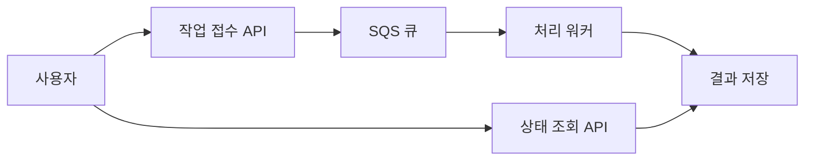

# 7장. 서버리스·비동기·데이터 처리

[목차](README.md) · 다음: [운영](08-operations.md)

## 1. 동기와 비동기

동기는 요청한 쪽이 완료 응답을 기다리는 방식이다. 비동기는 작업을 접수한 뒤 별도 처리하고 상태나 결과를 나중에 확인할 수 있다. 긴 영상 처리라면 작업 ID를 돌려주고 워커가 처리하는 방식이 적합할 수 있다.

비동기는 복잡도가 사라지는 방식이 아니다. 재시도·중복·실패 상태·사용자 통지를 설계해야 한다.

## 2. Lambda와 API Gateway

Lambda는 이벤트 기반 함수 실행에 사용한다. 실행 시간·메모리·배포 패키지·동시성 등의 제약을 확인해야 한다. 큰 GPU 모델을 억지로 함수 형태로 넣기보다 모델 요구에 맞는 실행 환경을 고른다.

API Gateway는 API 진입점과 인증·요청 관리 등 요구를 검토한다. 실제 지원 기능은 API 유형에 따라 다르다. 함수 실행 역할과 API 사용자의 인증은 서로 다른 문제다.

## 3. SQS의 핵심

생산자는 메시지를 넣고 소비자는 메시지를 받아 작업한다. 소비자가 메시지를 받으면 가시성 제한 기간 동안 다른 소비자에게 보이지 않도록 처리되지만, 성공적으로 삭제하지 못하면 다시 전달될 수 있다.

Standard queue는 적어도 한 번 전달과 최선의 순서 유지 특성을 고려한다. 따라서 소비자는 중복에 대비한다. FIFO가 필요하면 메시지 그룹·중복 제거 조건을 살피되 외부 DB 변경 같은 부수 효과까지 자동으로 정확히 한 번 보장된다고 가정하지 않는다.

### 구체적인 실패 흐름

워커가 결과를 저장하고 메시지를 삭제하기 직전에 종료됐다. 메시지가 다시 나타나면 두 번째 워커가 같은 결과를 다시 저장할 수 있다. 작업 ID에 대한 원자적 조건부 기록 등으로 중복 효과를 막는 설계가 필요하다.

DLQ에는 반복적으로 실패한 메시지를 모아 조사할 수 있다. DLQ를 만들었다고 실패 이유가 자동 수정되지는 않는다. 다시 처리할 기준과 절차를 적는다.

## 4. SNS·EventBridge·Step Functions

SNS는 발행/구독으로 여러 대상에 알림을 전달하는 요구와 연결한다. EventBridge는 이벤트의 패턴과 규칙을 이용해 대상에 전달하는 구조를 공부한다. SQS는 작업을 쌓아 소비자가 처리하는 큐다.

Step Functions는 여러 작업의 순서·분기·재시도 등을 상태 흐름으로 구성하는 요구와 연결한다. 예: 업로드 확인 → 전처리 → 예측 → 결과 저장 → 통지. 각 단계 실패 시 어디부터 다시 실행할지 결정한다.

## 5. 데이터 분석 서비스의 역할

| 목적 | 검토할 서비스 |
|---|---|
| S3 자료를 SQL로 분석 | Athena |
| 데이터 카탈로그·ETL | Glue |
| 분석용 데이터 웨어하우스 | Redshift |
| Spark/Hadoop 등 분산 처리 | EMR |
| 연속적인 스트림 처리 기반 | Kinesis 계열 |
| 관리형 스트림 전달 | Amazon Data Firehose |
| 배치 작업 스케줄·실행 | AWS Batch |

서비스 선택은 데이터 규모·도착 주기·허용 지연·쿼리 패턴에서 출발한다. 하루 한 번 결과가 필요한데 복잡한 실시간 처리를 도입하면 운영 비용만 늘 수 있다.

분석 파일을 날짜별로 나누고 필요한 열만 읽기 좋은 형식으로 저장하면 스캔량 감소에 도움이 될 수 있다. 작은 파일을 과도하게 쪼개는 것 역시 성능에 영향을 주므로 크기와 접근 패턴을 함께 평가한다.

## 확인 질문

1. 작업이 접수됐다는 응답과 완료됐다는 응답은 같은가? → 아니다. 상태를 명확히 구분한다.
2. 재시도가 있으면 중복 방지가 필요 없는가? → 오히려 중복 가능성을 고려해야 한다.
3. 배치와 스트림의 선택 기준은? → 결과가 필요한 시간, 입력 도착 방식, 운영 복잡도 등이다.

참고: [SQS Standard](https://docs.aws.amazon.com/AWSSimpleQueueService/latest/SQSDeveloperGuide/standard-queues.html), [Lambda](https://docs.aws.amazon.com/lambda/latest/dg/welcome.html), [Step Functions](https://docs.aws.amazon.com/step-functions/latest/dg/welcome.html).
